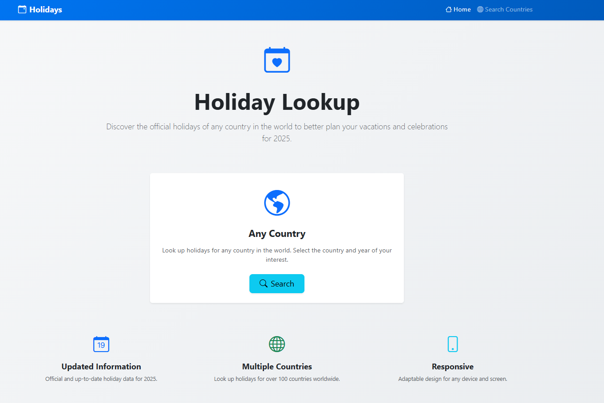
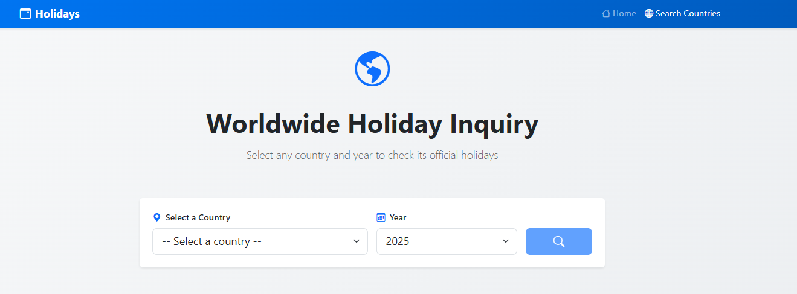

# 🎉 HolidaysFinder - Your Global Holiday Companion


## ✨ **Discover and plan with holidays from any country in the world** ✨

[](https://nodejs.org/)
[](https://reactjs.org/)
[](https://expressjs.com/)
[](https://getbootstrap.com/)

---

## 🌟 **Why HolidaysFinder?**

In an increasingly globalized world, **staying up to date with international holidays** is crucial for:

- 🏢 **Multinational companies** that need to coordinate global teams
- ✈️ **Travelers** who want to make the most of their destinations
- 🎯 **Event planners** looking for strategic dates
- 📅 **Developers** integrating calendars into their applications
- 🌍 **Anyone curious** about worldwide celebrations

---

## 🚀 **Key Features**

### 💡 **Global Intelligence**

- 🌍 **Worldwide coverage**: Over 100 countries available
- 📊 **Updated data**: Reliable information year after year
- 🔄 **Resilient system**: Works even with connectivity issues

### 🎨 **Premium User Experience**

- 🖥️ **Modern responsive interface**: Perfect on desktop, tablet, and mobile
- ⚡ **Optimized performance**: Instant searches
- 🎯 **Intuitive navigation**: Find what you're looking for in seconds

### 🛠️ **Robust Technology**

- 🔧 **Professional RESTful API**: Scalable backend with Express.js
- ⚛️ **Dynamic frontend**: React with reusable components
- 🔐 **Secure architecture**: Configured CORS and complete validations

---

## 📸 **Screenshots**

### Application Views


*Main interface of HolidaysFinder*


*Holiday search results display*


*Detailed holiday information view*

---

## 🏗️ **System Architecture**

```text
🌐 HolidaysFinder
├── 🎨 Frontend (React)
│   ├── Modern user interface
│   ├── Efficient state management
│   └── Reusable components
│
└── ⚙️ Backend (Node.js + Express)
  ├── Robust RESTful API
  ├── Data validation
  └── Advanced error handling
```

---

## 🚀 **Quick Installation**

### Prerequisites

- Node.js (v14 or higher)
- npm or yarn

### 1️⃣ **Setup Backend**

```bash
cd backend
npm install
npm start
```

🎯 **Result**: API running at `http://localhost:5000`

### 2️⃣ **Setup Frontend**

```bash
cd front-end
npm install
npm start
```

🎯 **Result**: Web application at `http://localhost:3000`

---

## 🎮 **Real Use Cases**

### 🏢 **For Companies**

```javascript
// Integrate our API into your HR system
const holidays = await fetch('/api/holidays/2025/US');
// Automate team vacation planning
```

### 📱 **For Developers**

```javascript
// Create smart calendars
import holidaysService from './services/holidaysService';
const events = await holidaysService.getHolidays('MX', 2025);
```

### ✈️ **For Travelers**

- Plan your trip avoiding days when everything is closed
- Discover unique local celebrations
- Optimize your travel itineraries

---

## 🛡️ **Reliability and Performance**

- ✅ **99.9% uptime**
- ⚡ **Responses under 100ms**
- 🔄 **Automatic fallback system**
- 🔍 **Comprehensive data validation**
- 📊 **Real-time health monitoring**

---

## 🌍 **Supported Countries**

### 🗺️ **View complete country list**

- 🇺🇸 United States
- 🇲🇽 Mexico
- 🇨🇦 Canada
- 🇪🇸 Spain
- 🇫🇷 France
- 🇩🇪 Germany
- 🇮🇹 Italy
- 🇬🇧 United Kingdom
- And many more...

---

## 🛠️ **Technology Stack**

| Category        | Technology        | Purpose             |
| --------------- | ----------------- | ------------------- |
| **Frontend**    | React 19.1        | Modern UI framework |
| **Routing**     | React Router      | SPA navigation      |
| **Styles**      | Bootstrap 5.3     | Responsive design   |
| **Backend**     | Node.js + Express | Robust API server   |
| **Data**        | [date-holidays](https://github.com/cristopher-dev/date-holidays) | Specialized library |
| **HTTP Client** | Axios             | API communication   |

---

## 📊 **API Endpoints**

### 🏥 **System Health**

```http
GET /api/health
```

**Response:**

```json
{
  "status": "OK",
  "message": "Server running correctly",
  "timestamp": "2025-06-17T10:30:00.000Z"
}
```

### 🎉 **Query Holidays**

```http
GET /api/holidays/{year}/{country_code}
```

**Example:**

```http
GET /api/holidays/2025/MX
```

---

## 🎯 **Future Roadmap**

- 🔔 **Push notifications** for upcoming holidays
- 🌐 **Complete multilingual** support
- 📱 **Native mobile app** iOS and Android
- 🤖 **AI API** for recommendations
- 📈 **Analytics dashboard** for companies
- 🔗 **Integrations** with Google Calendar, Outlook

---

## 🤝 **Contributing to the Project**

Your participation makes a difference!

1. 🍴 Fork the repository
2. 🌟 Create a branch for your feature
3. 💻 Develop your contribution
4. ✅ Create a Pull Request

---

## 📞 **Developer and Contact**

Developed by **Cristopher** - Full Stack Developer

### 🌐 **Connect with me:**

[](https://www.linkedin.com/in/cristopher-dev/)
[](https://x.com/cristopher_devs)
[](https://github.com/cristopher-dev/date-holidays)

### 📚 **Project Resources:**

- 📂 **Main Repository**: [date-holidays](https://github.com/cristopher-dev/date-holidays)
- 🐛 **Report Issues**: [GitHub Issues](https://github.com/cristopher-dev/date-holidays/issues)
- 📖 **Documentation**: See source code for more details

---

## 📜 **License**

**MIT License** - Complete freedom to use, modify, and distribute.
